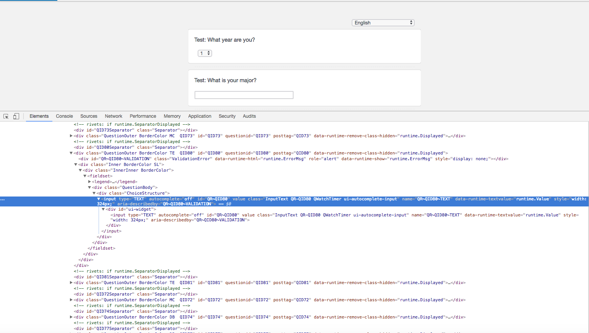
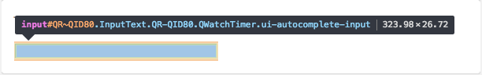
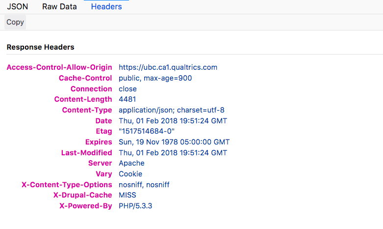
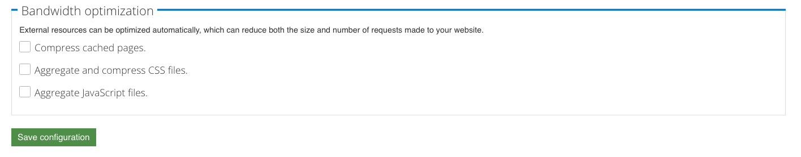

# <div id="top">UBC Qualtrics-Drupal integration</div>
A link to Qualtrics survey for demo: https://ubc.ca1.qualtrics.com/jfe/form/SV_0oiEz2f76DneukR<br>
A link to Drupal website for demo: https://qualtrics.dp7prod.webi.it.ubc.ca/

## Table of Contents:
- Getting started [&#10140;](#getting-started)
- Embedding Qualtrics survey to a website [&#10140;](#embedding-qualtrics-survey)
- How to make an embedded survey responsive [&#10140;](#responsive-survey)
- How to get [anonymous-survey-link] [&#10140;](#anonymous-survey-link)
- Exporting JSON feeds from Drupal to Qualtrics [&#10140;](#exporting-json-feeds)
- For Developers: Guide to Debug [&#10140;](#developers-info)
## <div id="getting-started">Getting started:</div>
To learn more about Drupal, please visit [here](https://drupal.org) for more information.
<br />To learn more about Qualtrics, please visit [here](https://www.qualtrics.com) for more information.

### Required contrib modules:
- Views [&#10140;](https://www.drupal.org/project/views)
- Views Datasource [&#10140;](https://www.drupal.org/project/views_datasource)
- Chaos Tools Suite [&#10140;](https://www.drupal.org/project/ctools)
- CKEditor - WYSIWYG HTML editor [&#10140;](https://www.drupal.org/project/ckeditor)

To download the above contrib modules, here is a [good tutorial](https://www.ostraining.com/blog/drupal/install-modules/) that covers how to install and enable contrib modules in Drupal.

If you are comfortable using Drush, Drupal's command line tool, then you can run the following commands:
```
$ drush -y dl views views_datasource ctools ckeditor
$ drush -y en views views_json views_ui
```

### Required custom modules:
- UBC Qualtrics Drupal Integration [&#10140;](https://github.com/ubc-web-services/ubc_qualtrics_drupal_integration/tree/master/modules/custom/qualtrics_drupal_integration)
- UBC Qualtrics Static Endpoint [&#10140;](https://github.com/ubc-web-services/ubc_qualtrics_drupal_integration/tree/master/modules/custom/qualtrics_static_endpoint)

If you are comfortable using Git, you can 
```
$ git clone https://github.com/ubc-web-services/ubc_qualtrics_drupal_integration.git
```
to download files. If not, you can choose to download a .zip file. [Here](https://stackoverflow.com/questions/2751227/how-to-download-source-in-zip-format-from-github/#18583977) is a good reference.

## Settings information in this demo:
- Theme: UBC CLF 7.0.4 Drupal Theme 3.0 [&#10140;](https://github.com/ubc-web-services/Megatron)
- Administration theme: Adminimal - Responsive Administration Theme [&#10140;](https://www.drupal.org/project/adminimal_theme)
- Additional installed modules:
	- Administration menu [&#10140;](https://www.drupal.org/project/admin_menu)

> Note: All screenshots are from Drupal website for demo. If you started your own Drupal website, you can install the modules mentioned above to have the same look and feel of the website we are demonstrating.

## <div id="embedding-qualtrics-survey">Embedding Qualtrics survey to a website:</div>
1. Download Drupal and start building your own Drupal website.
2. Create a basic page:
Go to __Content > Add content > Page__.
Select  button located at the bottom row of the text editing tools.
In Body field, add:<br />
```html
<iframe align="middle" frameborder="no" height="800px" name="qualtrics" scrolling="auto" src=[anonymous-survey-link] width="800px"></iframe>
```

<br />
You can copy and paste the above line, but you __must__ replace the __[anonymous-survey-link]__ with your own.
<br />You can retrieve your own __[anonymous-survey-link]__ with the step-by-step [instruction](#anonymous-survey-link).
<br />In the case of demo, the link is https://ubc.ca1.qualtrics.com/jfe/form/SV_0oiEz2f76DneukR.

3. Save the page to see the survey embedded to the designated page.
## <div id="responsive-survey">How to make an embedded survey responsive:</div>
1. Go to the page on your Drupal website with a Qualtrics survey embedded from the previous step and click __Edit__.
2. In the __Body__ field, add a containing wrapper around `iframe`. You can choose to copy and paste the below example:
```html
<div class="embedded-survey">
	<iframe align="middle" frameborder="no" height="800px" name="qualtrics" scrolling="auto" src=[Anonymous Survey Link] width="800px">
	</iframe>
</div>
```
3. Add the below line of code in your CSS file or wrap around `<style>` tag:
```css
.embedded-survey {
    position: relative;
    padding-bottom: 56.25%;
    height: 0;
    overflow: hidden;
}
.embedded-survey iframe {
    position: absolute;
    top:0;
    left: 0;
    width: 100%;
    height: 100%;
}
```
4. Click __Save__.

For more information, visit [here](https://www.smashingmagazine.com/2014/02/making-embedded-content-work-in-responsive-design/).

## <div id="anonymous-survey-link">How to get [anonymous-survey-link]:</div>
1. Go to Qualtrics website and login using your CWL account.
2. Create a survey for demo.

For the purpose of demo, I created a survey titled as ___Test: Course Evaluation___.
3. Click the survey title to see the page similar to this:

4. Go to __Distribution__ tab located at the top of the page, and the link will be provided when the page is loaded.


## <div id="exporting-json-feeds">Exporting JSON feeds from Drupal to Qualtrics:</div>
1. Create a page view:
Go to __Structure > Views > Add new view__ and select __Create a page__. Click __Continue & Edit__.
Under __Format__ field, click __Unformatted list__.
Click __JSON data document__ and click __Apply (all displays)__.


<strong>For the advanced Drupal developers:</strong> you can choose to select __Fields__ instead of __Contents__ to export fields of your choice. Moreover, you can choose different display modes(e.x. Default, etc.) other than __Teaser__ demonstrated in our example for a desired display style.

2. Once saved, you will be able to see the preview at the bottom of the page that is similar to this:
```
{
  "nodes" : [
    {
      "node" : {
        "title" : "Wood Products Processing"
      }
    },
    {
      "node" : {
        "title" : "Statistics"
      }
    },
    {
      "node" : {
        "title" : "Pharmacy"
      }
    },
...
```
If you click __Settings__ next to JSON data document under __Format__ field, you can modify root object name (___nodes___ in this demo) and top-level child object(___node___ in this demo).

3. Go to Qualtrics website and login using your CWL account.

4. Create a survey, or locate the existing survey that you wish to import JSON feeds from your Drupal website.

5. There are __two__ question types that will be discussed in this demo: creating a drop-down list or an autocomplete text field:

* To create a __drop-down list__, create a question of type __Multiple Choice__. Then, right-click the question card of interest to locate __Add JavaScript__ option.


Copy and paste the code provided below:

In JavaScript:
```javascript
Qualtrics.SurveyEngine.addOnReady(function() {
    $.getJSON('https://[YOUR_SITE_DOMAIN/ENDPOINT]', function(data) {

        var nodes = data.nodes;

        var counter = 0;

        var new_html = '<select class="ChoiceStructure Selection QR-QIDXX QWatchTimer" name="QR~QIDXX" id="QR~QIDXX" data-runtime-value="runtime.Selected">';
        console.log($('.QR-QIDXX').html())
        for (var node of nodes) {
            new_html += '<option class="Selection" value="' + counter + '" id="QR~QIDXX~' + counter + '">' + node.node.title + '</option>';
            counter++;
        }
        new_html += '</select>'
        $('.QR-QIDXX').html(new_html);

    });

});
```

__NOTE:__ The variable ___counter___, which is incremented at each loop, will be assigned as a __value__ attribute to each option.

* To create an __autocomplete text field__, create a question of type __Text Entry__. Then, right-click the question card of interest to locate __Add JavaScript__ option.


Copy and paste the code provided below:

In jQuery:
```javascript
Qualtrics.SurveyEngine.addOnReady(function() {
    $.getJSON('https://[YOUR_SITE_DOMAIN/ENDPOINT]', function(data) {
        var nodes = data.nodes;
        var availableTags = [];
        for (var node of nodes) {
            availableTags.push(node.node.title);
        }
        var org_html = '<input type="TEXT" autocomplete="off" id="QR~QIDXX" value="" class="InputText QR-QIDXX QWatchTimer ui-autocomplete-input" name="QR~QIDXX~TEXT" data-runtime-textvalue="runtime.Value" style="width: 324px;" aria-describedby="QR~QIDXX~VALIDATION">'
        var new_html = '<div id="ui-widget">' + org_html + '</div>';
        $('.QR-QIDXX').html(new_html);
        $(".QR-QIDXX").autocomplete({
            source: availableTags
        });
    });
});
```
__IMPORTANT:__ Note that __QR~QIDXX__ and __QR-QIDXX__ are unique to each question, and they need to be replaced. You can find the last two digits of your question ID's and classes by going to the preview of your survey, inspect the page and hover over the question of your interest and look for __ID__.



In this case, the question ID is __QR~QID80__, highlighted in ___orange___ color.


Your __[YOUR_SITE_DOMAIN/ENDPOINT]__ is the path assigned to your page view created for exporting JSON feeds.

6. Click __save__ button, and find  button on top of the page.

7. Click and you will see a pop-up window that looks like this:


8. Click __Advanced__ option and add below lines to __Header__ section:
```html
  <meta charset="utf-8">
  <meta name="viewport" content="width=device-width, initial-scale=1">
  <link rel="stylesheet" href="//code.jquery.com/ui/1.12.1/themes/base/jquery-ui.css">
  <link rel="stylesheet" href="/resources/demos/style.css">
  <script src="https://code.jquery.com/jquery-1.12.4.js"></script>
  <script src="https://code.jquery.com/ui/1.12.1/jquery-ui.js"></script>
```

11. Click __save__ button, and click  to have a preview look of your survey.

## <div id="developers-info">For Developers: Guide to Debug</div>
### If questions are not displayed properly or failed to retrieve JSON feeds from Qualtrics side:
There is a quick way to check whether Qualtrics Drupal Integration module has been set up properly in __Firefox__.<br />
1. Go to your website and locate the page view with the JSON feeds you wish to export.
2. At the top of the browser, there are three tabs: __JSON, Raw Data, and Headers__. If you click __Headers__, you should see Access-Control-Allow-Origin header similar to this:


<br />under __Response Headers__.

3. If not, you would want to go back to your Drupal website and see if the __module has been installed and enabled__, and make sure that __all the caches are cleared__.

### When adding custom CSS or JavaScript files in Drupal
By default, Drupal automatically optimizes external resources to reduce both the size and number of requests made to your website.
Hence, you want to make sure that these options are disabled in order to properly load your custom CSS and JavaScript files:
1. Go to __Configuration > Development > Performance__ or simply __admin/config/development/performance__.
2. Under __Bandwidth Optimization__, disable all three options: Compress cached pages, Aggregate and compress CSS files, and Aggregate JavaScript files.

3. Click __Save Configuration__.

Back to Top [__&#10140;__](#top)
